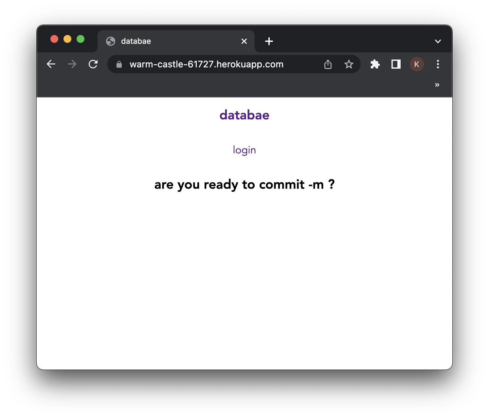

## databae version 1.0.0

## Description
 This project is a CMS-style chat app, where developers can chat publicly and anonymously. This app follows the MVC paradigm in its architectural structure, using Handlebars.js as the templating language, Sequelize as the ORM, and the express-session npm package for authentication.




LINK TO DEPLOYED APPLICATION:
https://warm-castle-61727.herokuapp.com/

## Table of Contents 

* [Installation](#installation)
* [Usage](#usage)
* [Credits](#credits)


## Installation

To install this project, navigate to your comand line console (for simplicity we will assume you are using terminal) and:

Clone this repository.

ensure you have installed node.js by checking the version.
```md
node -v
```
if it has not been installed please navigate to https://nodejs.org/en/download/. lastly, ensure you have installed the relevant node packages found in the package.json. If they have not been installed, install them.
```md
npm i
```

## Credits

This project is derivative of a group project, where my commite can be found here: https://github.com/Bprendaj/databae


